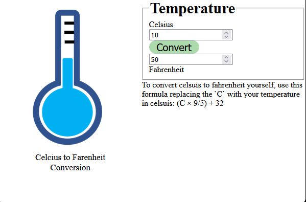

# Add Javascript interactivity to a HTML page through links

## Now you will add event listeners to the buttons in the web page, to make them functional.

1. Create a new file named `script.js.`

```bash
touch script.js
```

2. Link `script.js` to index.html

```html
  <head>
      
      <script src="script.js"></script>
  </head>
```
3. Add the function to convert temparature from Celsius to Fahrenheit

```js
function temperature() {
    var c = document.getElementById("celsius").value
    var f = (c * 9/5) + 32
    document.getElementById("fahrenheit").value = f
}
```

4. Link the temperature section of index.html to the temperature function in script.js

```html
<button id="temperature" onclick="temperature()"> Convert </button> <br/>
```



5. Do the same for `weight `and `distance`