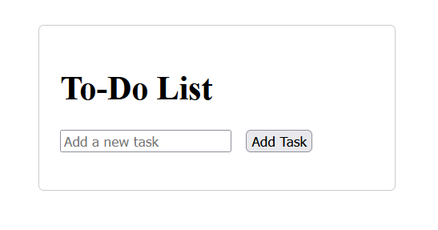
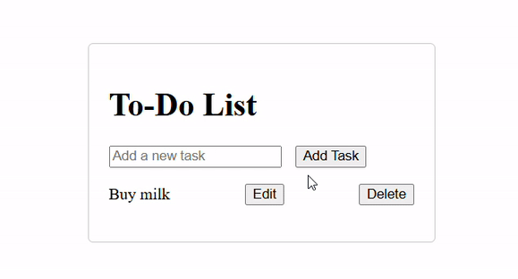

# Manipulating DOM with JavaScript

- The Document Object Model (DOM) represents the structure of an HTML document as an object, allowing you to interact with and modify the content, structure, and styles of web pages dynamically. 

## Starter code for a `to-do` app



- The `<input>` field with `id="taskInput"` allows users to enter new tasks.
```html
<input type="text" id="taskInput" placeholder="Add a new task">
```
- There is a button to trigger adding tasks.
```html
<button class="add-btn" onclick="addTask()">Add Task</button>
```
- The `<ul>` with the `id="todoList"` will hold the list of tasks.
```html
<ul class="todo-list" id="todoList"></ul>
```

- The `.todo-container` class is used to style the to-do list container, centering it and adding padding and borders for a clean look.

```html
<div class="todo-container">
    <!-- to-do basic structure -->
</div>

```
- The `.todo-list` class styles the unordered list, and `li` items are given margin and flexbox styling to align items neatly.
```html
<ul class="todo-list" id="todoList"></ul>
```

## Adding a task to the To-Do List

- When the user types a task into the input field and clicks the Add Task button, the task will be added to the list.
- Each task will be displayed with Edit and Delete buttons next to it.

1. Create the function
```js
function addTask(){
        // the function logic
    }
```

2. Obtain control of the value from the `input `tag

```js
    const input = document.getElementById("taskInput")
    const taskText = input.value.trim()
```
- `trim()`  trims whitespace from both ends of input.

3. `If` input is not empty create the `li` tag element that hold the task, `else` create an `alert` message

```js
    if(taskText != "") {
            // ... Create task code block
    } else {
            alert("Please enter a valid task:")
           }
```

4. `Task` code block

- create the list item `<li>`

    ```js
    const li = document.createElement("li");
    ```
- create the `text` element

    ```js
    const span = document.createElement("span");
    span.textContent = taskText;
    ```
    - `taskText` is the value inserted from the input

- create `edit` button

    ```js
    const editButton = document.createElement("button");
    editButton.textContent = "Edit";
    editButton.onclick = () => editTask(span);
    ```
    - when the `<Edit>` button is clicked it's triger the function `editTask()` used for edit the task 

- creat `remove` button

    ```js
    const removeButton = document.createElement("button");
    removeButton.textContent = "Delete";
    removeButton.onclick = () => removeTask(li);
    ```
    - When the `<Delete>` button is clicked it's triger the function `removeTask()` used for deleting the entire `<li>` task

- append buttons and text to the `<li>` item

    ```js
    li.appendChild(span);
    li.appendChild(editButton);
    li.appendChild(removeButton);
    ```
- append `<li>` item to the `<ul>` list

    ```js
    ul.appendChild(li);
    ```
- clear `<input>` afeter each isertion

    ```js
    input.value = "";
    ```

