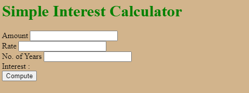
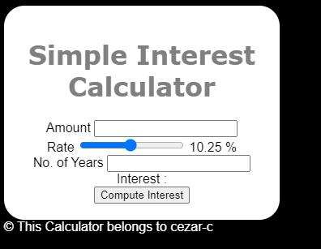
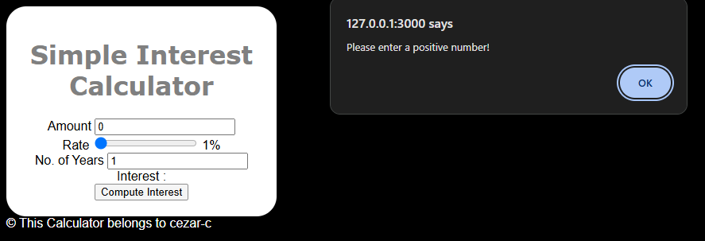

# Simple Interest Calculator

## Download the project folder

```bash
wget https://github.com/ibm-developer-skills-network/vftvk-Simple-Interest-Calculator/archive/refs/heads/master.zip
```

```bash
unzip master.zip
```



## Modify the HTML file

1. Add the `<doctype>` tag to the beginning of index.html.

    ```html
    <!DOCTYPE html>
    ```
2. Use the `<title>` tag to change the browser title to be “Simple Interest Calculator”

    ```html
    <title>Simple Interest Calculator</title>
    ```

3. Move all the content which is currently in the `<body>` to a new `<div>` tag with a class `maindiv`

- VS code shorcut `div.maindiv` for creating a div with a class maindiv
- use `CTRL + X` for cut and paste `CTRL  + V`

4. Modify the input `id="rate" `tag for the interest rate to be a slider.

    ```html
    <input type="number"  id="rate">
    ```
    - mofify the `type` atribute from `number` to `range`

5. For the rate input, add the following attributes and their corresponding values:
- `min `should be set to 1
- `max `should be set to 20
- `value` should be set to 10.25
- `step `should be set to 0.25

    ```html
    <input type="range" id="rate" min="1" max="20" value="10.25" step="0.25">
    ```

7. To show the value selected by the range, create a `<span>` element right after the range, with the id `rate_val`

    ```html
    <span id="rate_val">
        <!-- default value -->
    </span>
    ```

8. Inside the `<span> `tag, add the text `10.25 `to represent the default value. Add a `%` outside this span tag. The span will be updated dynamically later on, but the `%` should always remain, so this is placed outside the tag.

    ```html
    <span id="rate_val">
    10.25
    </span>% <br/>
    ```

9. Modify the input text box for `No. of Years `into a dropdown box with options 1 to 10.

    ```html
    <input type="number"  id="years">
    ```
create a detalist conected to the input atribut named `list="all_years"`

```html
No. of Years 
<input type="number" id="years" list="all_years">
<datalist id="all_years">
    <option value="1">1</option>
    <option value="2">2</option>
    <!-- Fill in the rest of the values -->
</datalist>
```

10. Change the name of `Compute` button to `Compute Interest`.

    ```html
    <button onclick="compute()">Compute Interest</button>
    ```

11. Below the `Compute Interest` button, create an empty `<span>` and set its id to `result`

```html
<span id="result">
    <!-- display the result when the button is clicked -->
</span>
```

12. Outside the maindiv, add a copyright message using the `<footer>` tag, like below:

```html
<footer>
    &#169; This Calculator belongs to --your name--
</footer>
```

## Modify the CSS file

1. Set the body background color to `black`, font family to `arial` and font color to `white`.

```css
body {
    background-color: black;
    color: white;
    font-family: Arial, Helvetica, sans-serif;
}
```

2. Set the h1 color to `grey` and font to `verdana`

```css
h1{
    color: gray;
    font-family: verdana;
}
```

3. Create an entry for class `maindiv`

```css
.maindiv {
    
}
```

4. In the newly created `maindiv` class, set the following styles:

- Background color to `white`
- Font color to `black`
- Width to `300px`
- Padding to `20px`
- Border radius to `25px`
- Text alignment to `center`

```css
    background-color: white;
    color: black;
    width: 300px;
    padding: 20px;
    border-radius: 25px;
    text-align: center;
```



## Modify the JavaScript file

### Display Rate Slider Value

1. Create an empty function called `updateRate()`

    ```js
    function updateRate() {
        // function logic
    }
    ```
2. Inside the fuction create a variable `rateval` that gets the value from the `Rate` slider.

```js
const rateval = document.getElementById("rate").value;
```
3. Modify the `<span id="rate_val">` value to display the value of the rateval variable created above.

```js
document.getElementById("rate_val").innerHTML = rateval
```

4. Link this function with an `onchange` event on the range input.

```html
<input type="range" ... onchange="updateRate()">
```

### Compute Button Functionality

1. Create the following variables inside the `compute() `function, and assign them to the corresponding value listed:

- `rate` initialized to the value of the input element with an id of `rate`, parsed as a float. This is needed to calculate the interest amount
- `years` initialized to the value of the input element with an id of `years`, parsed as an int. This is needed to calculate the interest amount
- `interest` with the value `principal * num_years * rate / 100`. This is needed to calculate the total amount
- `amount` which is the sum of the integer value of` principal and the float value of interest`
- `result` initialized to the input element with an id of `result`. This is needed to modify the text when the Compute button is pressed

2. Write the logic to convert the `No. of Years` into the actual year in the future

    ```js
    var year = new Date().getFullYear() + parseInt(years);
    ```
    - `new Date().getFullYear()` get the actual year
    - `parseInt(years)` returns an integer

3. Add validation for the `Amount` input box.

- `If `the user enters zero or a negative value, show an alert and take the user back to the `Principal` input box, by setting the focus on this box
    ```js
    if(principal <= 0) {
            alert("Please enter a positive number!");
            document.getElementById("principal").focus();
        }
    ```
- `Else` render the text replacing the `[...]` with the actual value

```txt
If you deposit $[PRINCIPAL],<br>
at an interest rate of [RATE]%.<br>
You will receive an amount of $[INTEREST],<br>
in the year [YEAR]<br>

```

- **string interpolation**

```js
result.innerHTML = "If you deposit $" + "<mark>" + principal + "</mark>" + ",\<br\> at an interest rate of " + "<mark>" + rate + "%" + "</mark>" + "\<br\> You will receive an amount of $" + "<mark>" + amount + "</mark>" + ",\<br\> in the year " + "<mark>" + year + "</mark>" + "\<br\>";

```

- **template literals**

```js
else {
    result.innerHTML = `
        If you deposit $ <mark>${principal}</mark><br\>
        at an interest rate of <mark>${rate}</mark> %<br\>
        You will receive an amount of $ <mark>${amount}</mark>,<br>
        in the year <mark>${year}</mark><br>`
    }
```

### Test the Calculator

1. Enter these values in the form

```txt
 Amount = 0
 Rate = 1%
 No. of Years = 1
```



2. Enter these values in the form

```txt
 Amount = 4800
 Rate = 15.25%
 No. of Years = 5
```


