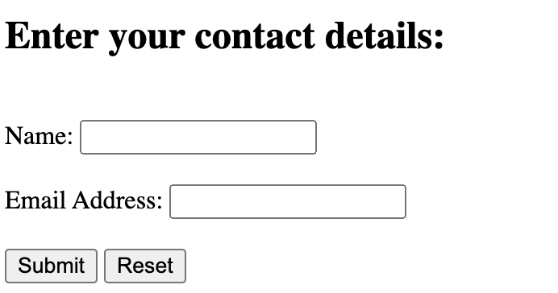

# Validating a JavaScript form

1. Create an HTML form



2. Use the `<script>` tag

```html
<head>
    <script type="application/javascript">
    </script>
    <title>Contact Details</title>
</head>
```

3. Add a JavaScript function that take control of the `name `value and the `email` value

```js
    function checkdata(){
            //Create references to the input elements we wish to validate
            var username = document.getElementById("name");
            var email_address = document.getElementById("email");
    }
```

4. Let’s check if the value is empty by using an if statement.

```js
        if(username.value == ""){
            return false;
        }
        if(email_address == ""){
            return false;
        }
```

5. Display error message

```js
            alert("Please enter the name");
            username.focus();
```
- The `username.focus()` statement is used to bring the input focus back to the element

6. Add a `return true` statement at the end of the function when none of the elements are blank.

```js
function checkdata(){

    //   ... the if code block test for name & email

     //If all is well return true.
      return true;
}

```

7. Execute a function when the form is submitted

```html
<form id="form1" onsubmit="return checkdata()">
```
- This code ensures that the `checkdata()` function is invoked every time the form is submitted.